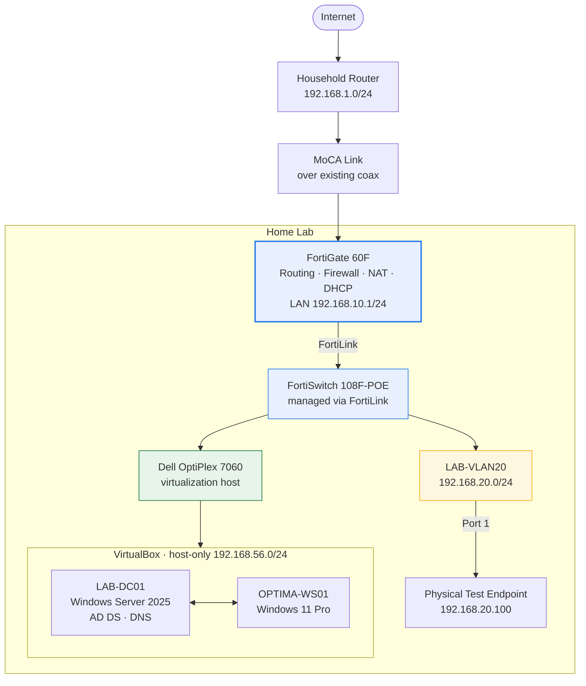

# Enterprise IT & Cybersecurity Home Lab

**IT & cybersecurity fundamentals I've built and practiced in my own home lab** — enterprise
networking on Fortinet hardware, a Windows Server 2025 Active Directory domain, and VirtualBox
virtualization, documented the way it would be documented on the job.

> This is a personal learning lab — hands-on practice on hardware I own, not professional
> production experience. Completed and unfinished work are kept in separate sections below.

---

## Project Highlights

| | Area | What was built and verified |
|---|---|---|
| 🔥 | **FortiGate 60F** | Lab edge device — routing, firewalling, NAT, DHCP, and VLAN gateway |
| 🔗 | **FortiSwitch / FortiLink** | FortiSwitch 108F-POE discovered, authorized, and managed from the FortiGate |
| 🧱 | **VLAN Segmentation** | `LAB-VLAN20` on its own subnet, gateway, and switch port |
| 🌐 | **DHCP / DNS / NAT** | DHCP scopes with DNS options; source NAT to the upstream network |
| 🛡️ | **Firewall Policies** | Explicit LAB-VLAN20 → WAN1 allow policy; nothing leaves without one |
| 🗂️ | **Windows Server 2025 / AD** | Domain controller, AD-integrated DNS, OU design, users, security group |
| 💻 | **VirtualBox** | Windows 11 VM with EFI, Secure Boot, TPM 2.0, and a dual-NIC design |
| 🔍 | **Troubleshooting** | Layer-by-layer isolation of a real DNS fault, fully written up |

---

## Architecture

**Why it's built this way:** the FortiGate sits *behind* the household router, so the entire lab
can be reconfigured or broken without affecting anyone else's Internet. Active Directory runs on
an isolated VirtualBox network so a networking mistake can't take the domain down mid-exercise.

| Network | Range | Gateway | Purpose |
|---|---|---|---|
| Main lab | `192.168.10.0/24` | `192.168.10.1` | General lab devices |
| LAB-VLAN20 | `192.168.20.0/24` | `192.168.20.1` | Segmented client VLAN |
| AD network | `192.168.56.0/24` | none (isolated) | Domain traffic between VMs |

More diagrams: [network topology](diagrams/network-topology.md) ·
[Active Directory](diagrams/active-directory-structure.md) ·
[security workflow](diagrams/security-workflow.md)

---

## Project Status

### ✅ Completed and verified

| Area | Work |
|---|---|
| **Networking** | FortiGate 60F configured as lab edge; WAN1 upstream over MoCA |
| | Main lab network `192.168.10.0/24` with FortiGate DHCP |
| | FortiSwitch 108F-POE authorized over FortiLink (FortiGate Port A ↔ FortiSwitch Port 7) |
| | `LAB-VLAN20` built — gateway, DHCP scope `.100`–`.200`, DNS `1.1.1.1` / `8.8.8.8` |
| | FortiSwitch Port 1 assigned to LAB-VLAN20; physical endpoint received `192.168.20.100` |
| | Firewall policy LAB-VLAN20 → WAN1 with NAT; verified with `ping 8.8.8.8` and `ping google.com` |
| **Active Directory** | Domain `optima.test` (NetBIOS `OPTIMA`) on Windows Server 2025 |
| | `LAB-DC01` healthy: AD DS, DNS, Kerberos, Netlogon, DC advertising |
| | Custom OU tree: Users (4 departments), Computers (Workstations / Servers), Groups, Service Accounts |
| | 4 user accounts in department OUs; `IT-HelpDesk` security group with 1 member |
| **Virtualization** | `OPTIMA-WS01`: Windows 11 Pro 25H2, 4 GB RAM, 2 vCPU, 80 GB, EFI, Secure Boot, TPM 2.0 |
| | Dual-NIC design — NAT for Internet, host-only for AD (static IP, no gateway) |
| | Verified DC reachability and `nslookup optima.test 192.168.56.10` |
| **Troubleshooting** | DNS fault on LAB-VLAN20 isolated, root-caused, fixed, and documented |

### 🔶 In progress — not yet complete

| Work | Current state |
|---|---|
| DNS resolver priority on `OPTIMA-WS01` | Cause understood; correction underway |
| Domain join of `OPTIMA-WS01` | **Not yet joined** — waiting on the DNS correction |
| `Kali-HomeLab` security-testing VM | **Being built** — no testing has been performed |

### ⬜ Planned — not started

| Work | Notes |
|---|---|
| Group Policy objects and `gpresult /r` verification | Designed, not created |
| Department security groups (`IT-Users`, `HR-Users`, `Finance-Users`, `Operations-Users`) | Designed, not created |
| Security testing workflow: recon → scanning → enumeration → web testing → vulnerability assessment | Planned for `Kali-HomeLab` only, against lab-owned systems |
| Aruba CX 6000 and Cisco Catalyst 9300 configuration | Racked, not configured |
| PS4 / untrusted-device VLAN and inter-VLAN policies | Not created |
| Moving the AD network onto a FortiGate-routed VLAN | So domain traffic passes through firewall policy |

---

## Featured Troubleshooting: IP Worked, DNS Didn't

| | |
|---|---|
| **Symptom** | A laptop on LAB-VLAN20 had a valid DHCP address and could `ping 8.8.8.8`, but `ping google.com` failed |
| **Key test** | `nslookup google.com 1.1.1.1` **succeeded** — proving the path to DNS was fine, so the client was asking the wrong server |
| **Root cause** | Two DNS servers still manually set on the laptop's adapter from a previous network, overriding what DHCP supplied |
| **Fix** | Set IPv4 back to *Obtain DNS server address automatically* — resolution worked immediately |
| **Lesson** | Reachability and name resolution are different problems. The network was correct the whole time; the fault was on the endpoint |

Full write-up with every test and what it proved: [docs/troubleshooting.md](docs/troubleshooting.md)

---

## What I Learned

- **Isolate by layer, not by guess.** One targeted test — `nslookup` against a named server — can
  rule out an entire layer in a single step.
- **The client is part of the network.** Correct firewall, DHCP, and NAT still produce a
  "broken Internet" ticket if the endpoint overrides what DHCP hands it.
- **Nothing leaves a firewall without a policy.** Correct addressing isn't enough; the policy
  table is the control point.
- **Managed switching changes the workflow.** Under FortiLink, the switch is configured from the
  firewall — a different model from a standalone switch CLI.
- **Directory design is structure, not just accounts.** Separating users, computers, groups, and
  service accounts is what makes Group Policy and delegation manageable later.
- **Documentation is part of the build.** Writing each step down exposed gaps the configuration
  itself hid.

---

## Documentation

| Document | Covers |
|---|---|
| [Architecture](docs/architecture.md) | Design goals, hardware, addressing plan, naming conventions |
| [Networking](docs/networking.md) | FortiGate, FortiLink, VLANs, DHCP, NAT, firewall policy |
| [Active Directory](docs/active-directory.md) | Domain build, OUs, users, groups, authentication flow |
| [Virtualization](docs/virtualization.md) | VirtualBox host, VM specs, virtual networking modes |
| [Cybersecurity Lab](docs/cybersecurity-lab.md) | Scope rules, environment separation, planned testing workflow |
| [Troubleshooting](docs/troubleshooting.md) | Methodology, case studies, command reference |

---

## Hardware

| Device | Role | Status |
|---|---|---|
| FortiGate 60F | Firewall / router / DHCP / NAT | ✅ In service |
| FortiSwitch 108F-POE | FortiLink-managed access switch | ✅ In service |
| Dell OptiPlex 7060 Micro | Virtualization host | ✅ In service |
| MoCA adapters | Uplink to household router over coax | ✅ In service |
| Rack enclosure + PDU | Housing and power | ✅ In service |
| Older Dell laptop | Physical test endpoint | ✅ In service |
| Aruba CX 6000 | Multi-vendor switching practice | ⬜ Racked, not configured |
| Cisco Catalyst 9300-series | Cisco CLI practice | ⬜ Racked, not configured |

---

## Scope and Honesty

This lab is self-built and self-funded as a Computer Information Systems student building
hands-on skills. It is **lab practice, not professional production experience** — there are no
real users, no production data, and no uptime obligations.

- All user accounts in the domain are fictional.
- Any future security testing is confined to systems built for this lab.
- No passwords, keys, serial numbers, license details, public IPs, or wireless details are
  published here. Private RFC 1918 addresses are included because they are meaningless outside
  the lab and necessary to understand the configuration.
