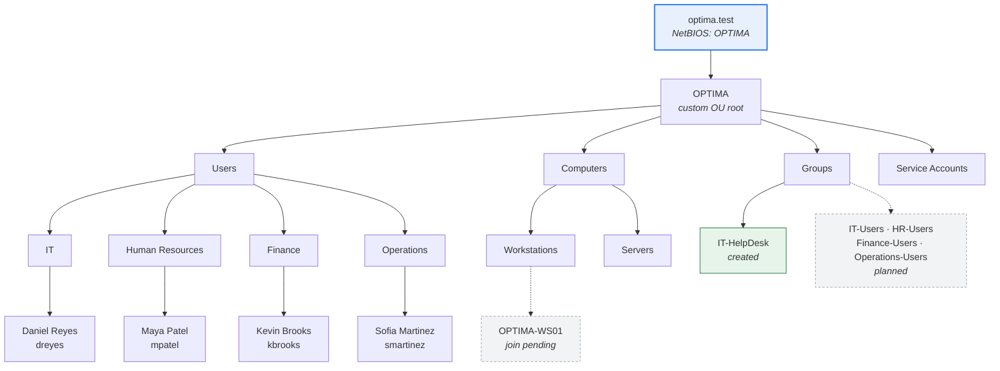
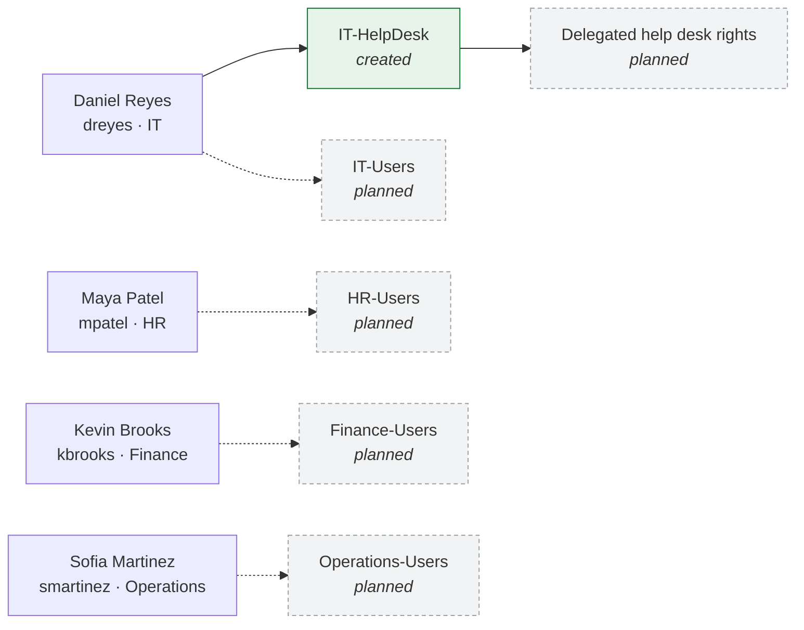
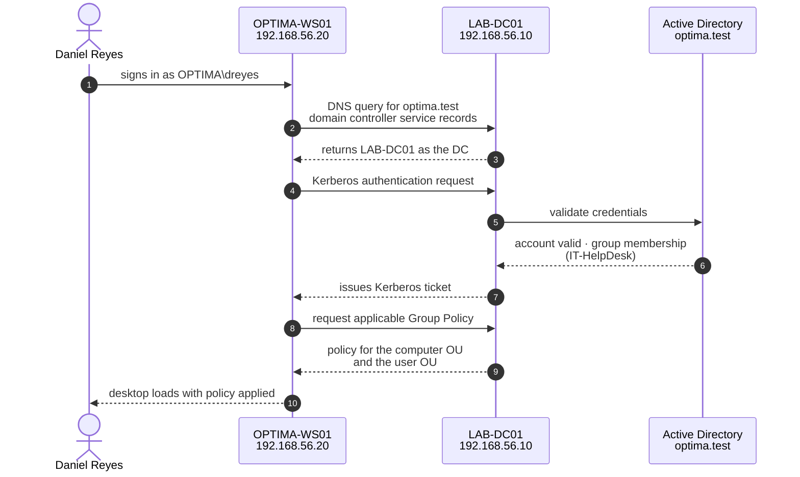
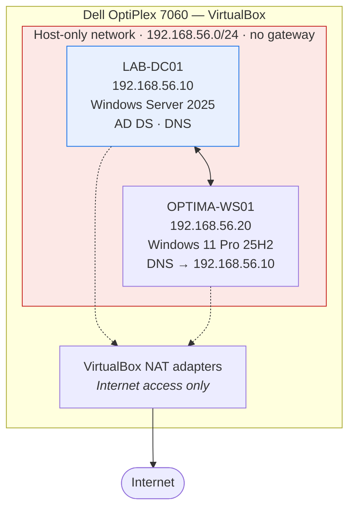

# Active Directory — Structure and Authentication

## Directory structure

Dashed nodes are **not built yet**: the four department security groups and the `OPTIMA-WS01`
computer object are planned or in progress, not done.

## Group membership

## Authentication flow

What happens when Daniel Reyes signs in to the workstation.
**Steps 3 onward have not happened yet** — they depend on the domain join, which is still in
progress.

The first two steps are the reason DNS matters so much in Active Directory: without the ability
to resolve the domain's service records, the workstation never finds a domain controller and
nothing after step 2 can happen — regardless of whether the DC is reachable by IP.

## Network placement of the AD environment

Each VM has two adapters: a gateway-less host-only adapter carrying all domain traffic, and a
NAT adapter carrying Internet traffic. Keeping the default route on the NAT adapter is what
creates the resolver-priority problem documented in
[`docs/troubleshooting.md`](../docs/troubleshooting.md#case-study-2--dns-resolver-priority-on-a-domain-client).
