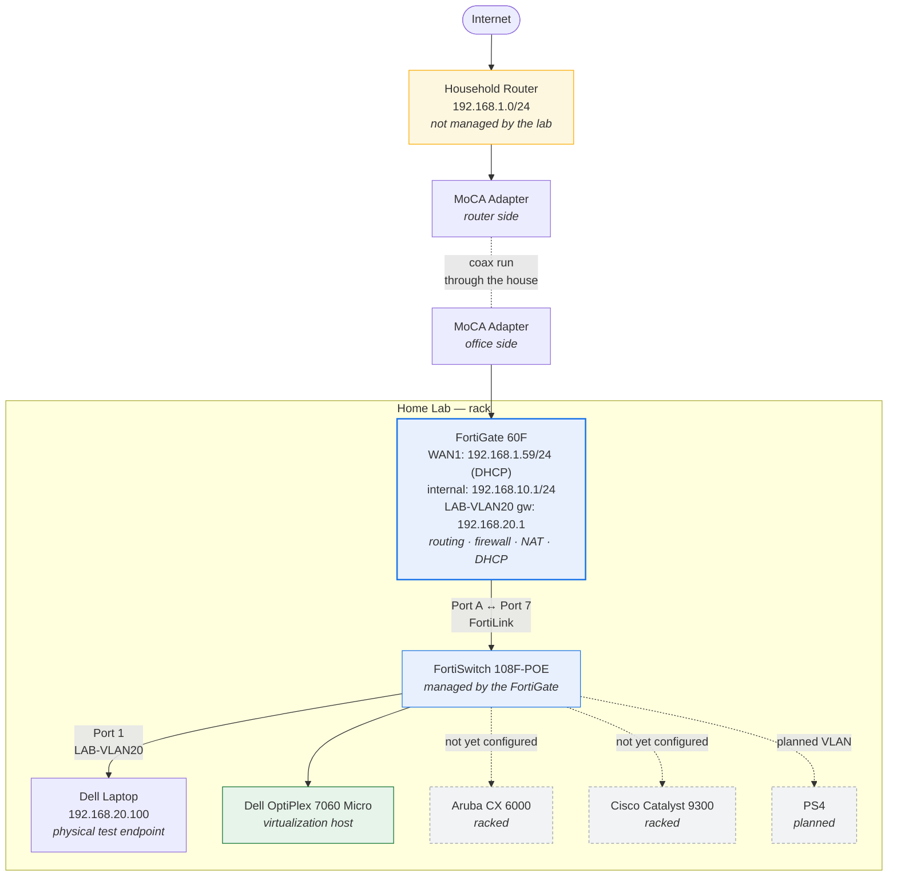
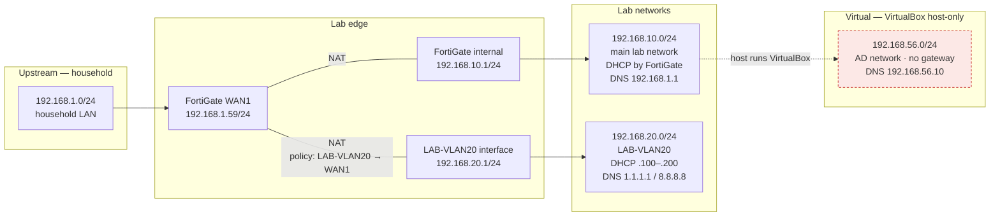
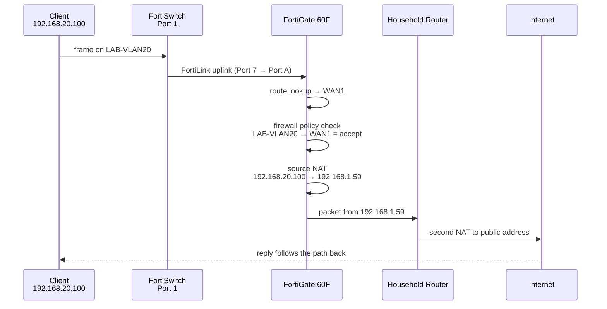

# Network Topology

## Physical topology

From the household Internet connection down to lab endpoints.

Dashed elements are racked or planned but **not yet configured**: the Aruba CX 6000, the Cisco
Catalyst 9300, and the PS4 VLAN.

## Logical networks

The AD network is drawn detached on purpose: it is a VirtualBox host-only network today, so
domain traffic does **not** pass through the FortiGate and is not subject to firewall policy.
Routing it through a FortiGate VLAN is a planned change.

## Traffic path — a lab client reaching the Internet

Two NAT translations happen on the way out — once at the FortiGate and once at the household
router. That double NAT is the cost of keeping the lab fully independent of the household
network.
