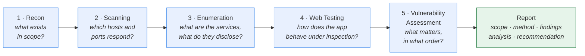
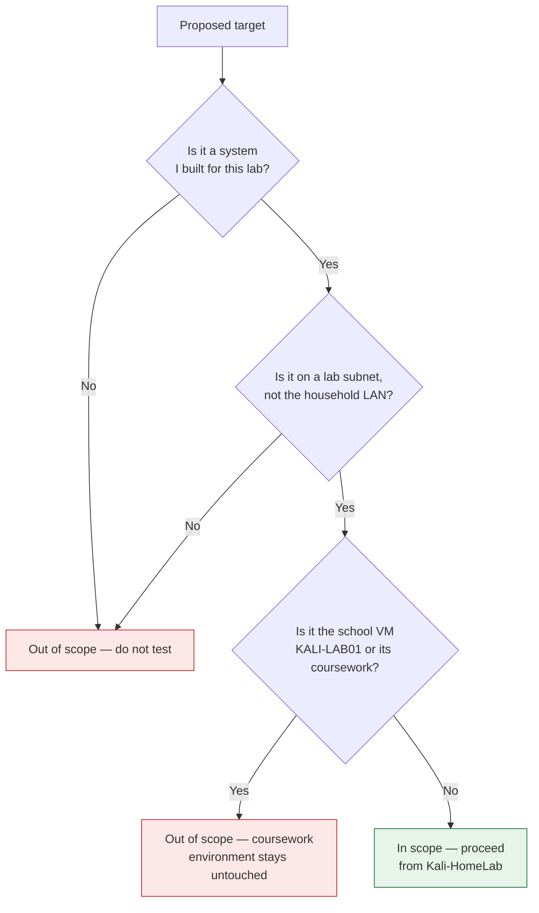
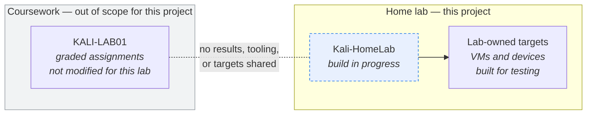
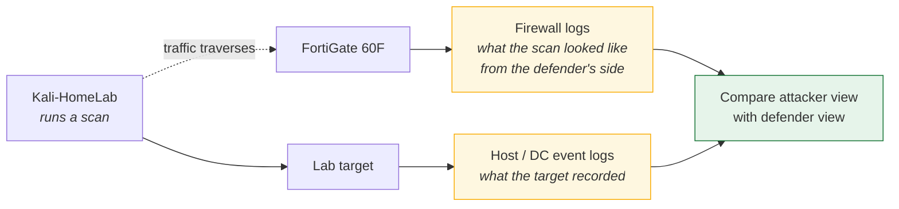

# Security Testing Workflow

All stages below run **only** against systems built for this lab. Scope rules are in
[`docs/cybersecurity-lab.md`](../docs/cybersecurity-lab.md#1-scope-and-authorization--read-first).

> **Nothing in this workflow has been run yet.** The `Kali-HomeLab` VM is still being built, and
> no stage below has produced a result.

## The five stages

Each stage narrows the input to the next. Skipping ahead — scanning without a defined scope, or
running a vulnerability scanner before knowing what the services are — produces volume rather
than findings.

## Scope gate

Every test passes through the same authorization check first.

## Environment separation

## Offensive and defensive halves

The value of running both sides on the same equipment is seeing one action from two vantage
points.

**The defensive log-review exercises are planned, not performed.**
